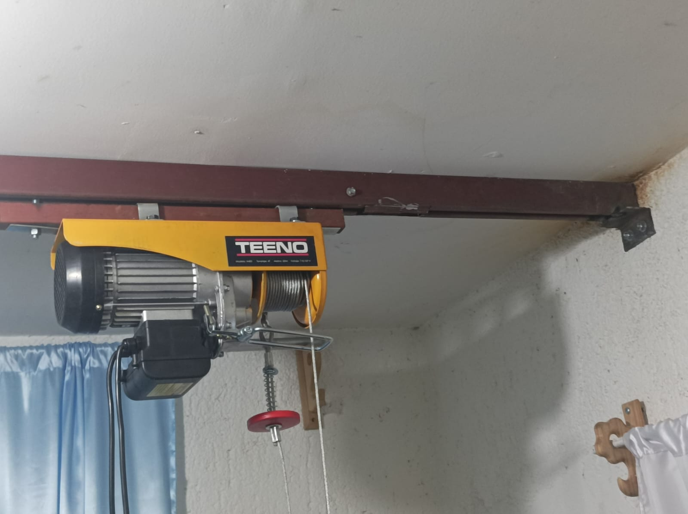
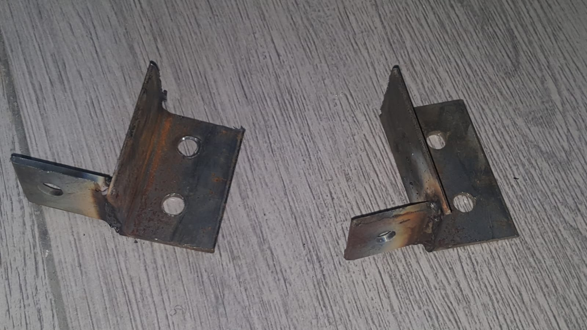
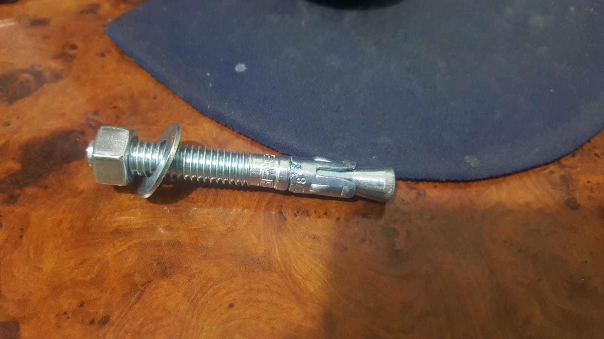
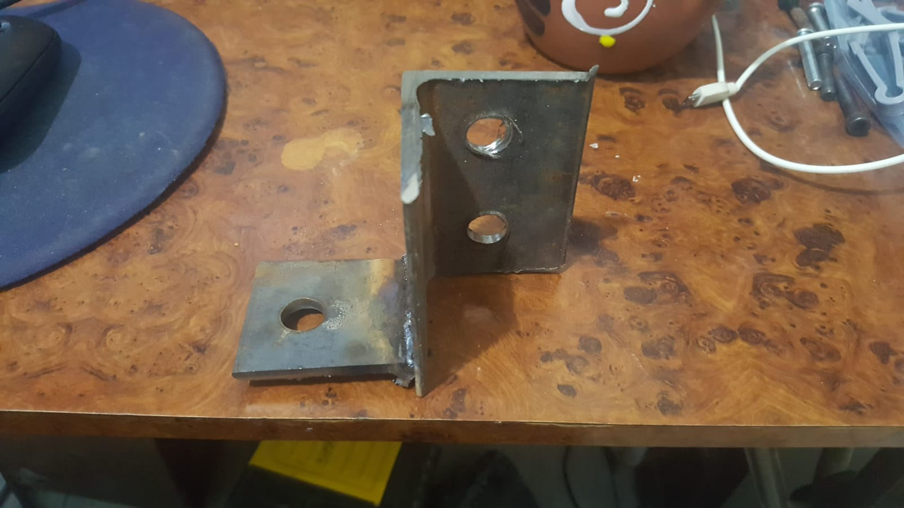
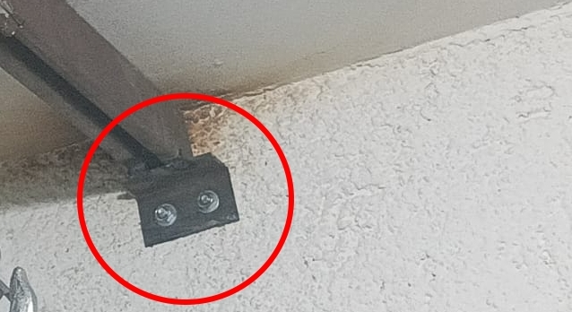
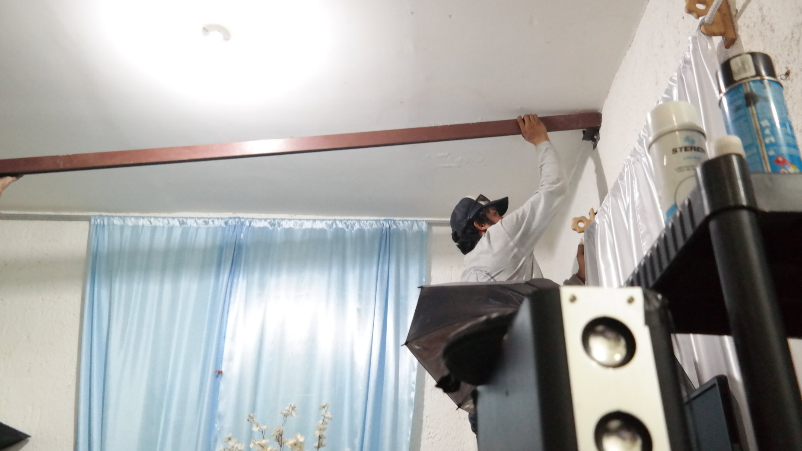
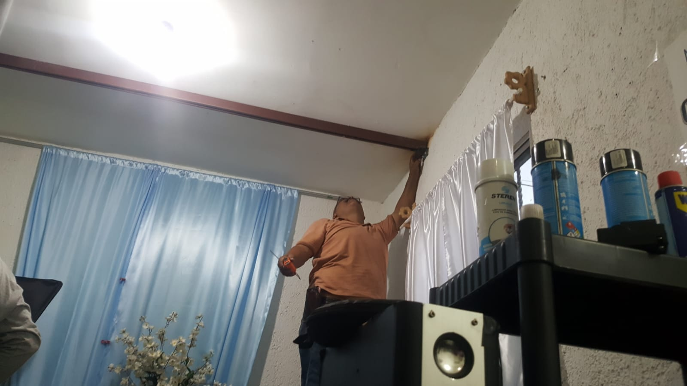
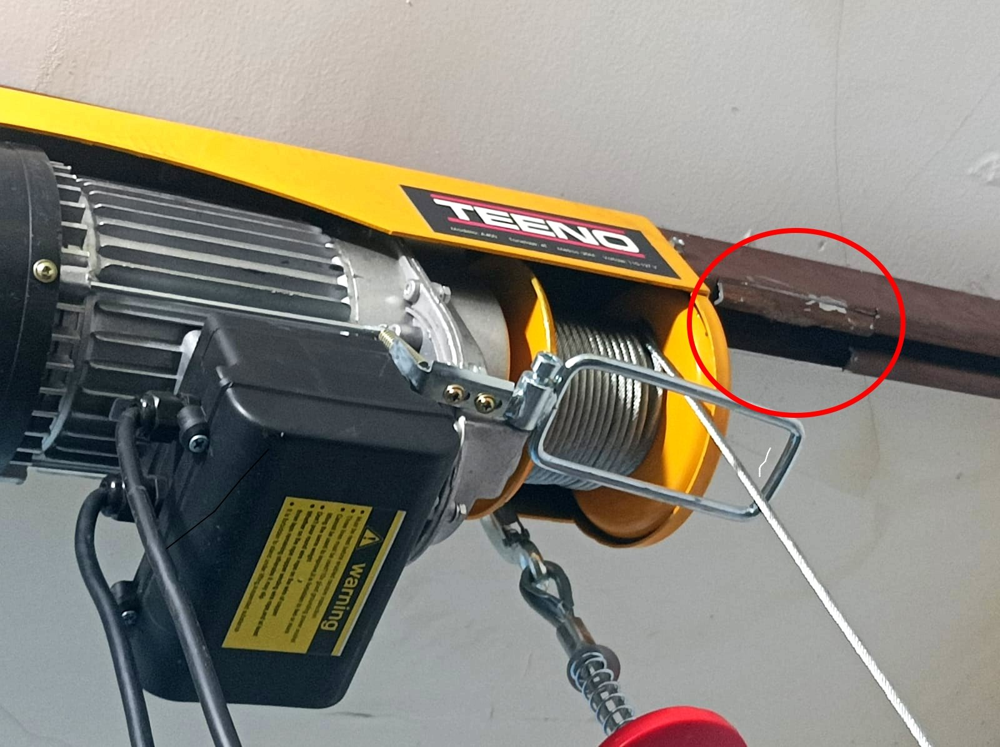
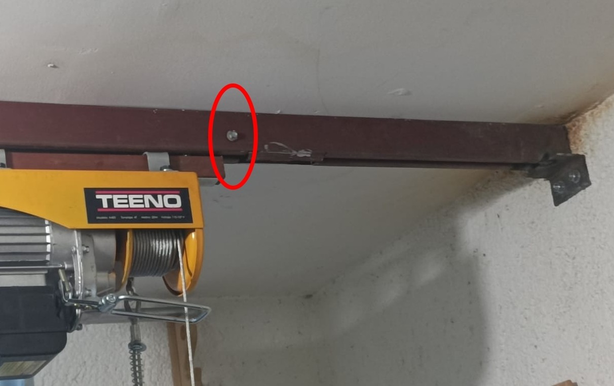

[TOC] 

# Instalación de riel y polipasto
En este post documentamos el proceso de instalación del riel para una grúa para traslado. 

# Materiales
+ 1 x Riel para portón 1500

+ 2 x Soportes angulares

+ 4 x Taquete de 3/8 de acero con tornillo.

+ 1 x Sistema de Rodamiento aéreo para riel

## Soportes angulares
Construidos con placa de 1/8". Barrenos de 3/8".

# Instrucciones

## 1. Instalar los soportes angulares

Los soportes angulares se colocan en la pared y son los que sostienen el riel.

Para colocar los soportes angulares usaremos los taquetes de acero. El taquete debe **instalarse en una dala o castillo**. 

**NOTA**: En caso de que no hubiera una dala o castillo accesible lo recomendable sería colocar los soportes angulares con tornillos que atraviesen la pared (revisar apéndice).

Una vez instalados ambos soportes angulares se coloca el riel encima de los mismos.

Una vez colocado el riel, puede sujetarse con un tornillo pasado, con rosca de seguridad o soldarse directamente al soporte angular.

## Colocación del polipasto
Para colocar el polipasto debe hacerse un corte en el riel, que permita que los rodamientos del polipasto entren por debajo del riel.

Una vez que se coloca el polipasto se coloca un tornillo atravesado en el riel, antes del corte, para garantizar que el polipasto no llegue a esa sección del riel.

# Apéndices
## Cómo colocar el soporte angular con tornillos atravesando la pared
