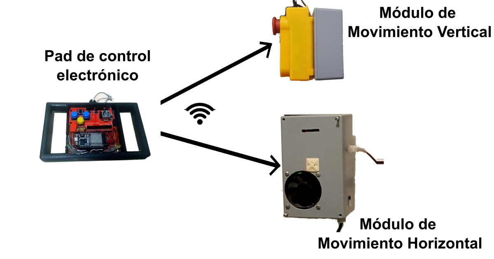

# Akoui Transfer Crane

The *Akoui* crane is [Olin Robotics](https://www.olinrobotics.com)' proposal for independent transfer of people with disabilities.

The Akoui belongs to the **Olin Autonomy** project; an ecosystem of assistive devices to allow independent living for people with disabilities, even severe ones, who can control a joystick.

---

The Akoui crane is made up of 3 modules:

1. **Vertical motion module**. Electronically controls the vertical movement of the crane. It has an ESP8266 module (WeMos D1 Mini).

2. **Horizontal movement module**. Electronically controls the horizontal movement of the crane. It has an ESP8266 module (WeMos D1 Mini).

3. **Control pad**. Sends movement commands to the respective modules. Uses an ESP-32 module (ESP-WROOM-32).

There is a [tutorial to build it](https://olinrobotics.com/blog/23-09_akoui-construccion-control-pad/p) on the Olin Robotics blog (in Spanish).

---
The Akoui is Free Hardware and Software. We believe in a world where technology for independent living is accessible and free.

If you want to support the development of Akoui, join the [Dojo of Autonomy on Patreon](https://www.patreon.com/olinrobotics?fan_landing=true).

**¡Hasta la Autonomía, Siempre!**
*Always to Autonomy!*

